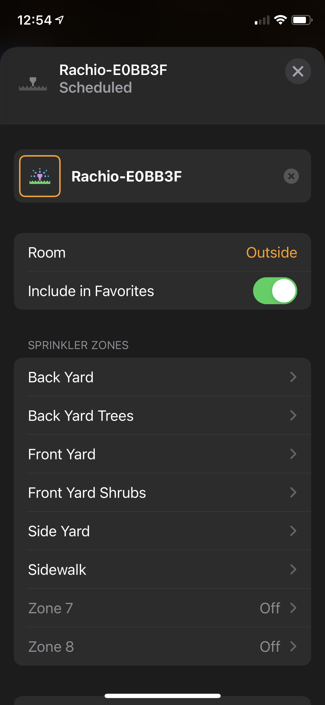
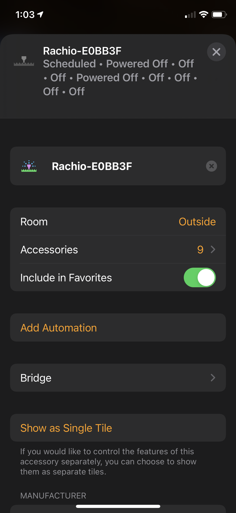

# homebridge-rachio-irrigation
[](https://github.com/homebridge/homebridge/wiki/Verified-Plugins)
<br>Rachio Irrigation System platform plugin for [HomeBridge](https://github.com/nfarina/homebridge).


## About

This plugin provides 3 options for use in HomeKit<br>Both option have additional switches as options for Standby mode and a Run All along with any Rachio Schedules
1.	Irrigation System Accessory with zones that are linked (default in configuration)
2.	Irrigation System Accessory with separate zones shown as a single tile 
3.	Irrigation System Accessory with separate zones shown as a separate tiles (option in Homekit)


### Screenshots
<p>
 <div align="center">
  
  
  
  
  
  
 </div align="left">
</p>
<br>There are plus and minus to each, so why not have options.
<br>


# API Key

You can acquire your API key from Rachio io.app [documented here](https://rachio.readme.io/docs/authentication).

## Note on Webhooks

`homebridge-rachio-irrigation` **requires** webhooks to update Homekit accessory status in real time such as a defined schedule from the Rachio app.


### Setting up webhooks, the easy way (if your router supports it):
 - You must know your external network IP address. [You can discover it here](https://www.myexternalip.com) to be entered in the config as the "external_Webhook_address"
 - You must enable port fowarding on your router this server is conected to. Follow you routers instructions for this set.
 - The port forwarding should look like external_webhook_port -> internal_port for your servers IP address which can be found on the Homebridge Status page in system information.
 - **NOTE:** if your IP Address is changed by your ISP, you will need to edit the IP address in the config to match it whenever it changes. You can use a Dynamic IP address DNS service if your IP changes often.

### If you cannot setup port forwarding on your router (or don't want to):
 - You must have an always-on computer available on your network (MacOS, Linux, Windows). If you're running Homebridge, you can use that one.
 - Create an account at [Webhook Relay](https://webhookrelay.com). The free account should be fine.
 - Create a new webhook relay:
   - Create a new "New Basic Forwarding" from the quickstart on the Dashboard.
   - Select _Use Default Input Domain_. Then Continue.
   - For _Destination URL_ enter: `http://127.0.0.1:27546/`
     - If you'll be installing the relay on a computer different from your Homebridge, replace the `127.0.0.1` with the ip or network name of your Homebridge server.
   - For _Output type_ choose: _Internal_
   - For _Lock destination path_ disable it so it says: _not locked_
   - Hit Continue so you're on the review step. Change your _Configuration name_ to something that makes sense for you.  I set mine to: `rachio-config`
   - Save everything by clicking on the Create Configuration button.
     - Copy the `Key`, `Secret`, and `relay CLI command` somewhere.  You'll need them later.
 - Now you'll need to install their Relay software on a computer on your network (probably wherever you have Homebridge installed). Install instructions can be [found here](https://docs.webhookrelay.com/installation-options/installation-options/install-cli).
 - Edit Settings for `homebridge-rachio-irrigation` to use the Webhook Relay
   - When setting up this plugin and you get to the _External IP Address_ section, just enter `127.0.0.1`. The field only accepts IP addresses, so you'll need to change it later manually in the config.json file.
   - Set the _External Webhook Port_ to: `80`
   - The _Internal Webhook Port_ can be left to the default `27546`. If you change it, be sure to change the _Destination URL_ in the Webhook Relay bucket settings you configured earlier.
   - After saving the settings, go to the Config tab in Homebridge UI, and scroll down to find the section for this plugin.  You're going to change only one item, and that's `external_IP_address` where it says `127.0.0.1` to the URL that the webhook Relay service gave you.  It'll look like `somethinglongandrandom.hooks.webhookrelay.com`. You can find it at _Request Forwarding > Buckets_ listed under _Default public endpoint_ in the Webhook Relay dashboard.
    - Save the Config changes in the top right, and restart Homebridge
 - Test it!
   - Make sure you're running the relay service, in Terminal or the command line, it'll look something like this: `relay forward -b rachio-config`
   - Go to `http://somethinglongandrandom.hooks.webhookrelay.com/test` in your browser and a moment later you should see in the Homebridge logs that the test was successful.
 - After you have tested everything works ok, you can make the Webhook Relay software always run by using the [instructions here](https://docs.webhookrelay.com/installation-options/installation-options/background-service).


The startup log will show if the configuration is correct and working.

If you see log messages like `Webhook received from an unknown external id`, you may set the `clear_previous_webhooks` flag to `true` to remove previous webhooks before creating or updating the webhook for this plugin. Note: this will clear all webhooks tied to your Rachio API key, so be careful if you rely on Rachio webhooks apart from this plugin.

## Installation
1. Install this plugin using: npm install -g homebridge-rachio-irrigation
2. Suggest running as a child bridge	
3. Use plugin settings to edit ``config.json`` and add your login detail.
4. Run Homebridge
5. Pair to HomeKit

## Config.json example
```
"platforms": [
        {
            "name": "Rachio-Dev",
            "api_key": "8e600a4c-0027-4a9a-9bda-abc8d5c90350",
            "default_runtime": 3,
            "use_irrigation_display": true,
            "show_standby": true,
            "show_runall": true,
            "show_schedules": true,
            "external_IP_address": "76.33.22.111",
            "external_webhook_port": 12453,
            "internal_webhook_port": 27543,
            "use_basic_auth": true,
            "user": "username",
            "password": "password",
            "delete_webhooks": false,
            "_bridge": {
                "username": "0E:79:49:DC:71:A9",
                "port": 46062
            },
            "platform": "rachio"
        }
]
```
