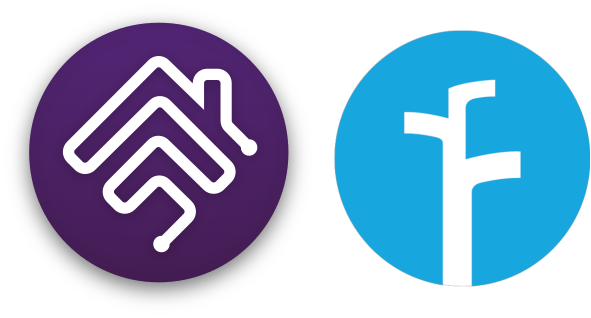
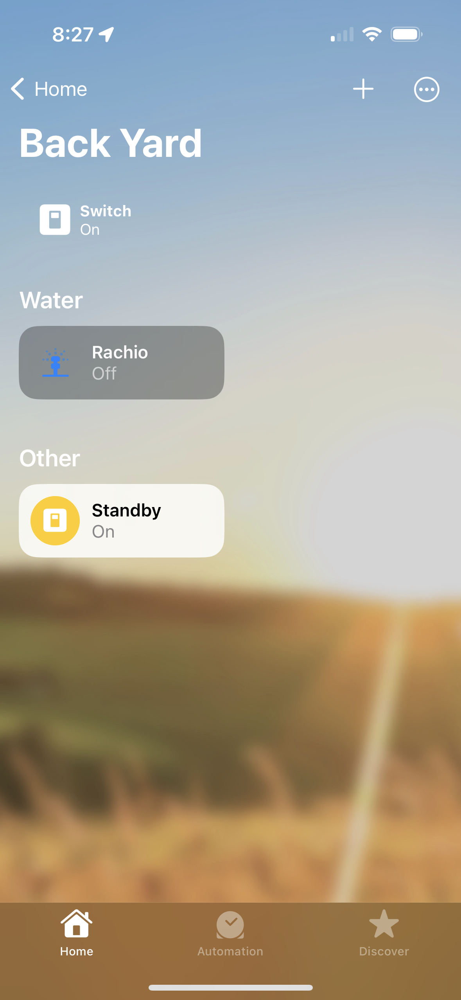
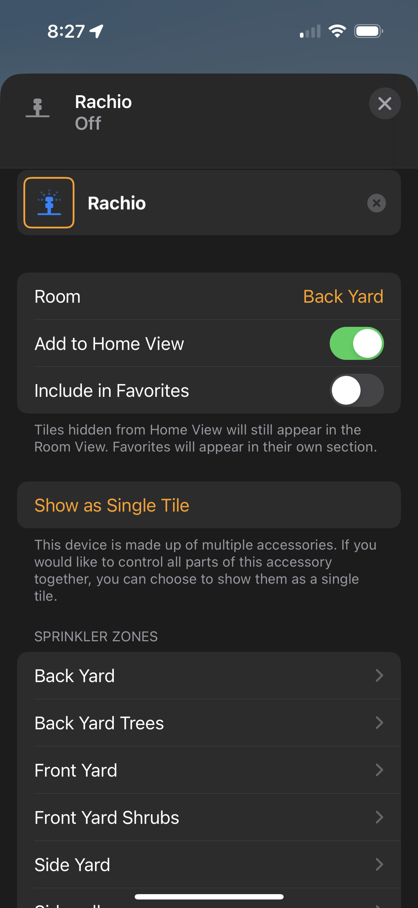
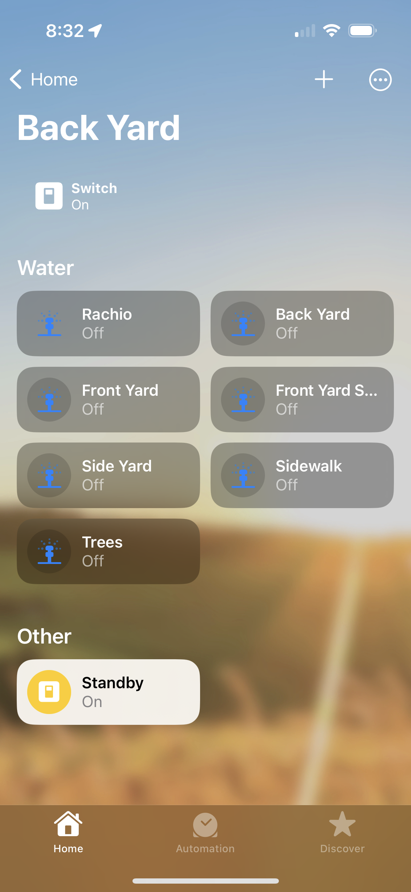

<p align="left">
 
</p>

# homebridge-rachio-irrigation
[](https://github.com/homebridge/homebridge/wiki/Verified-Plugins)
<br>Rachio Irrigation System platform plugin for [Homebridge](https://github.com/nfarina/homebridge).
<br>Supporting
- Rachio 1 Contollers.
- Rachio 2 Contollers.
- Rachio 3 Contrllers.
- Rachio Smart Hose Timers.

## Notes on the Smart Hose Timer
The Smart Hose Timer is currently not suppoerted by Webhooks or WebSocket. Updates will rely on polling.<br>
The plugin will only poll when there is a request from Homebridge or Homekit to get an update.
API activity can be viewed in the debug log and there are configurations to tweak this.
Battery support is limited to good and bad which traslated to 100% and 10%.
The bridge is worthless to expose, but my plan is to use that as the device for an irrigation system where the hose timer are the zones.
Hoping Rachio improves the new API


## About

This plugin provides multiple options for use in HomeKit<br>Both option have additional switches as options for Standby mode and a Run All along with any Rachio Schedules
1.	Irrigation System Accessory with zones that are linked (default in configuration)
2.	Irrigation System Accessory with separate zones shown as a single tile
3.	Irrigation System Accessory with separate zones shown as a separate tiles (option in HomeKit)

<br> There are plus and minus to each, so why not have options.
<br> If you have more than one home on your Rachio account you may filter devices for a home based on the street address for the location you want to display in HomeKit.
<br> If you are configuring more than one Homebridge instance, you will want to use a unique accessory name.
<br> Rachio caluclated runtimes based on your zones configuration, these runtimes can be used for the inital runtimes seen in HomeKit.

### Screenshots
<p>
 <div align="center">
  
  
  
 </div align="left">
</p>
<br>


## API Key

You can acquire your API key from Rachio io.app [documented here](https://rachio.readme.io/docs/authentication).

## Notes on Webhooks

`homebridge-rachio-irrigation` **requires** webhooks to update HomeKit accessory status in real time such as a defined schedule from the Rachio app.
### Only configure one webhook method at a time, if more than one is configured Webhook Relay will be used.

## Port fowarding
### Setting up webhooks, the easy way (if your router supports it):
 - You must know your external network IP address. [You can discover it here](https://www.myexternalip.com) to be entered in the config as the "external_Webhook_address"
 - You must enable port fowarding on the router this server is conected to. Follow you routers instructions for this step.
 - The port forwarding should look like external_webhook_port -> internal_port for your servers IP address which can be found on the Homebridge Status page in system information.
 - **NOTE:** if your IP Address is changed by your ISP, you will need to edit the IP address in the config to match it whenever it changes. You should use a Dynamic IP address DNS service if your IP changes often.
 - Advanced settings for HTTPS, If you have a registered domanin and a valid signed cerficate you may use TLS connection.

## Relay service
### If you cannot setup port forwarding on your router (or don't want to):
 - You must have an always-on computer available on your network (MacOS, Linux, Windows). If you're running Homebridge, you can use that one.
 - Create an account at [Webhook Relay](https://webhookrelay.com). The free account should be fine.
 - Create a new webhook relay: [here](https://my.webhookrelay.com/new-basic-forwarding)
   - Create a new "New Basic Forwarding" from the quickstart on the Dashboard.
   - Select _Use Default Input Domain_. Then Continue.
   - For _Destination URL_ enter: `http://127.0.0.1:27546/`
     - If you'll be installing the relay on a computer different from your Homebridge, replace the `127.0.0.1` with the IP or network name of your Homebridge server.
   - For _Output type_ choose: _Internal_
   - For _Lock destination path_ disable it so it says: _not locked_
   - Hit Continue so you're on the review step. Change your _Configuration name_ to something that makes sense for you.  I set mine to: `rachio-config`
   - Save everything by clicking on the Create Configuration button.
     - Copy the `Key`, `Secret`, and `relay CLI command` somewhere.  You'll need them later.
 - Now you'll need to install their Relay software on a computer on your network (probably wherever you have Homebridge installed). Install instructions can be [found here](https://docs.webhookrelay.com/installation-options/installation-options/install-cli).
 - Edit Settings for `homebridge-rachio-irrigation` to use the Webhook Relay
   - When setting up this plugin under the `Webhook Relay section` paste the Default Endpoint directly into the `Endpoint` field  It'll look like `somethinglongandrandom.hooks.webhookrelay.com`. You can find it at _Request Forwarding > Buckets_ listed under _Default public endpoint_ in the Webhook Relay dashboard. [found here](https://my.webhookrelay.com/buckets)
   - The _Internal Webhook Port_ can be left to the default `27546`. If you change it, be sure to change the _Destination URL_ in the Webhook Relay bucket settings you configured earlier.
   - Save the Config changes, and then restart Homebridge
 - Test it!
   - Make sure you're running the relay service, in Terminal or the command line, it'll look something like this: `relay forward -b rachio-config`
     - `rachio-config` should be the name of your bucket.
   - Go to `http://somethinglongandrandom.hooks.webhookrelay.com/test` in your browser and a moment later you should see in the Homebridge logs that the test was successful.
 - After you have tested everything works ok, you can make the Webhook Relay software always run by using the [instructions here](https://docs.webhookrelay.com/installation-options/installation-options/background-service).

The startup log will show if the configuration is correct and working.

If you see log messages like `Webhook received from an unknown external id`, you may set the `clear_previous_webhooks` flag to `true` to remove previous webhooks before creating or updating the webhook for this plugin. Note: this will clear all webhooks tied to your Rachio API key, so be careful if you rely on Rachio webhooks apart from this plugin.

## Installation
1. Install this plugin using: npm install -g homebridge-rachio-irrigation
2. Suggest running as a child bridge
3. Use plugin settings to edit ``config.json`` and add your account detail.
4. Run Homebridge
5. Pair to HomeKit

## Config.json example with child bridge
```
{
	"name": "Rachio-Dev",
	"api_key": "8e600a4c-0027-4a9a-9bda-abc8d5c90350",
	"location_address": "123 Main St",
	"default_runtime": 3,
	"runtime_source": 2,
	"use_irrigation_display": true,
	"show_standby": true,
	"show_runall": true,
	"show_schedules": true,
	"external_IP_address": "76.76.73.37",
	"internal_IP_address": "127.0.0.1",
	"external_webhook_port": 12454,
	"internal_webhook_port": 27544,
	"use_basic_auth": true,
	"https": false,
	"key": "/somepath/key.pem",
	"cert": "/somepath/cert.pem",
	"user": "username",
	"password": "password",
	"delete_webhooks": false,
	"showAPIMessages": false,
	"showWebhookMessages": false,
	"valveType": 0,
	"showBridge": false,
	"showControllers": true,
	"showValves": true,
	"liveRefreshTimeout": 2,
	"liveRefreshRate": 20,
"_bridge": {
		"username": "0E:79:49:DC:71:A9",
		"port": 46062
	},
	"platform": "rachio"
}
```
